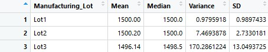
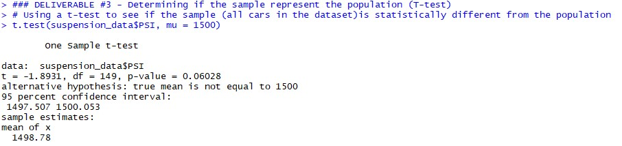
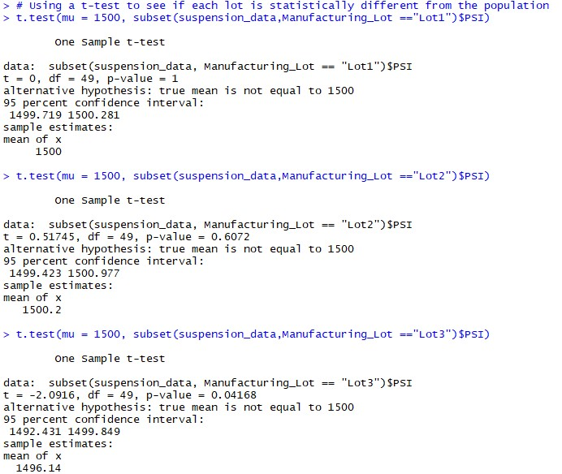

# MechaCar_Statistical_Analysis

## Linear Regression to Predict MPG

### Interpretation
1. After producing the summary results of our linear regression model on the MechaCar data, we can see multiple variables that were statistically proven to show non-random amount of variance. The variables that have a big impact on MPG are vehicle length and ground clearance.
2. We can also see that the p-value of our linear model slope is significantly low (5.08e-8); less than our significance level of .05%. This means we have enough evidence to reject the null hypothesis, which means that the slope of our linear regression model is NOT zero. This can also be justified as mentioned earlier, the dependent variable(MPG) is highly impacted by two different variables. This means that the slope cannot be zero, as the dependent variable is not determined purely by random chance.
3. Does the linear model predict MPG of MechaCar prototypes effectively? Statistically, our model is shown to acurately predict MPG. This is shown as our p-value is less than our significance level - reasons mentioned before. We can also see that our r-squared value to be high (.72). The r-sqaured value indicates that 72% of the variability is explained by the regression model.

## Summary Statistics on Suspension Coils
 

### Interpretation
The design specifications for the MechaCar suspensions coils dictate that the variance of the suspension coils must not exceed 100 pounds per square inch. What we can see in a summary statistic table, we can see that the actual variance (62.3psi) of our dataset is significantly less. However, looking at lot 3 of our data set, we can see that the variance(170psi) is significantly greater than 100 psi. This means that lot 3 does not meet specifications.

## Study Design: MechaCar vs Competition
#### T-test comparing all manufacturing lots against the mean PSI of the population
   
#### T-test comparing each manufacturing lots against the mean PSI of the population

### Interpretation
As we can see, after conducting a T-test comparing all manufacturing lots, we can see that the p-value(.06) is greater than the significane level(.05). Due to this fact, the means of the sample and the population are statistically similar. Looking at the different cases between the lots, we can see that lot 3's p-value(.04) is  less than the significance level(.05). This statistically proves that the means of lot 3 and the population are statistically DIFFERENT. This concludes that lot 3 is not a good representation of the population

## Study: Comparing the MechaCar to the Competition
To do a study to compare the performance the MechaCar and its competitors, we will use inferential statistic prrocesses(such as the ttest) to determine the differences on certain desirable factors.
1. Desirable metrics to be compared in this study could be safety, fuel efficiency, and durability.
2. The null hypothesis would to be: There is no statistical difference between MechaCar and the selected competitor based on the desirable metric we choose to look at.
3. A unpaired two-sample T-test can be used to determine whether there is a statistical difference in samples means between MechaCar and its competitor. This can help show how well the prototype car can compete with other established cars
4. We would need a significant amount of data, enough to acurately produce statistical tests such as the T-tests. This data would contain information on all the desirable metrics. All the data we would be looking at would be quantiative (EX: horse-power, cost, safety rating). 
