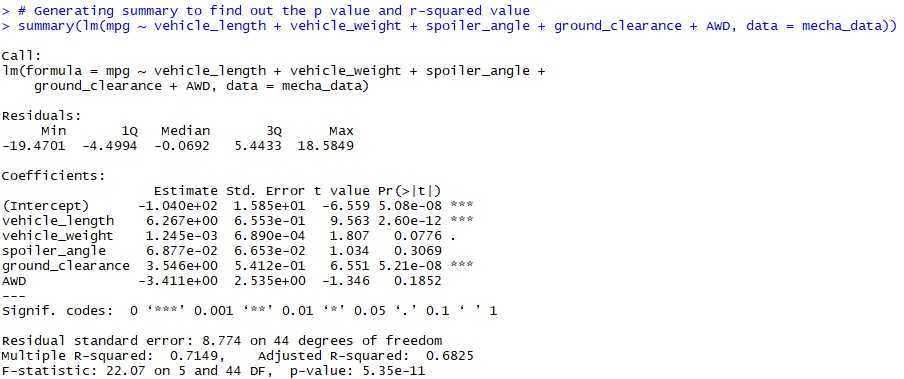

# MechaCar_Statistical_Analysis

## Linear Regression to Predict MPG

## Interpretation
1. After producing the summary results of our linear regression model on the MechaCar data, we can see multiple variables that were statistically proven to show non-random amount of variance. The variables that have a big impact on MPG are vehicle length and ground clearance.
2. We can also see that the p-value of our linear model slope is significantly low (5.08e-8); less than our significance level of .05%. This means we have enough evidence to reject the null hypothesis, which means that the slope of our linear regression model is NOT zero. This can also be justified as mentioned earlier, the dependent variable(MPG) is highly impacted by two different variables. This means that the slope cannot be zero, as the dependent variable is not determined purely by random chance.
3. Does the linear model predict MPG of MechaCar prototypes effectively? Statistically, our model is shown to acurately predict MPG. This is shown as our p-value is less than our significance level - reasons mentioned before. We can also see that our r-squared value to be high (.72). The r-sqaured value indicates that 72% of the variability is explained by the regression model.

### Summary Statistics on Suspension Coils

